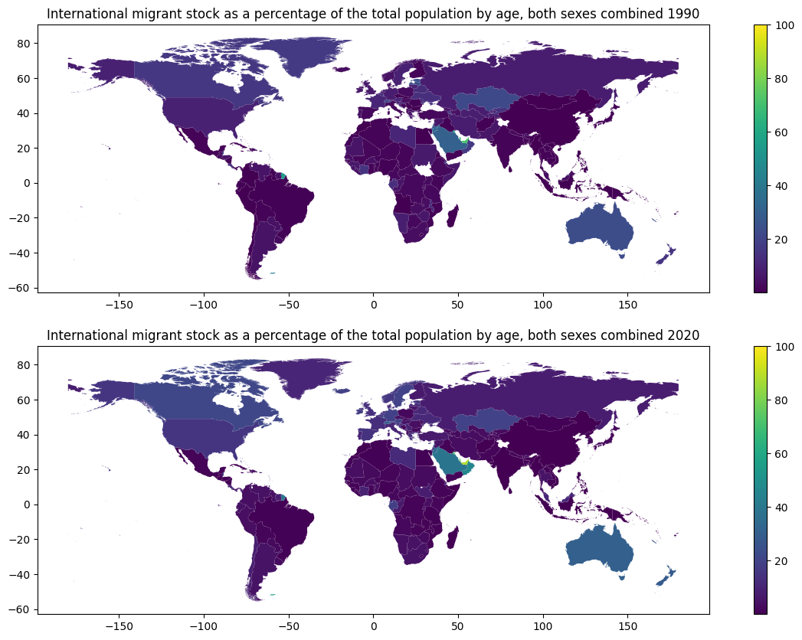
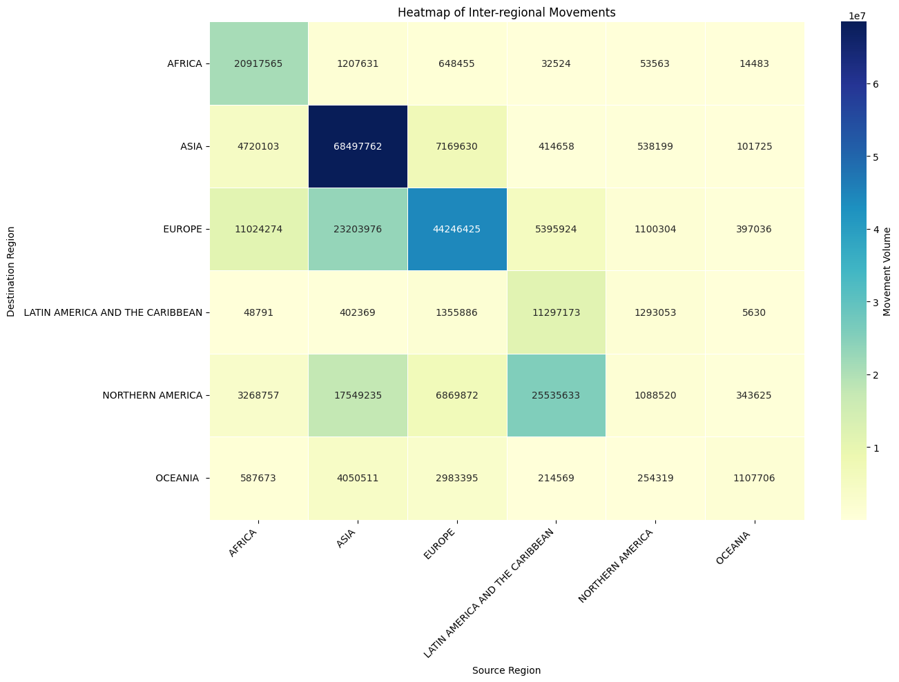
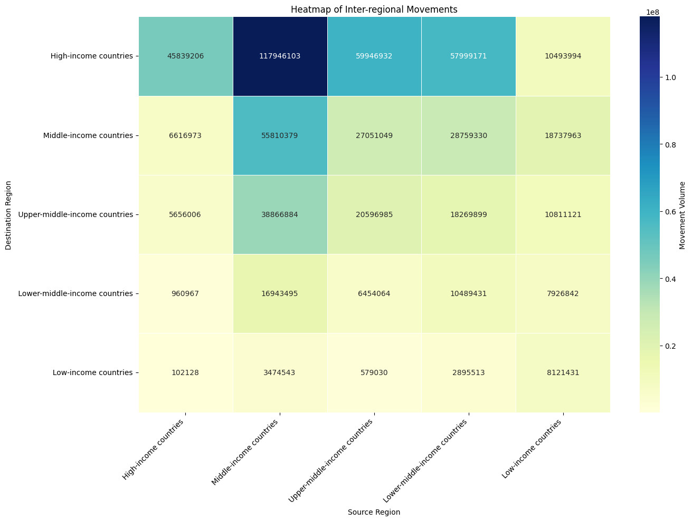
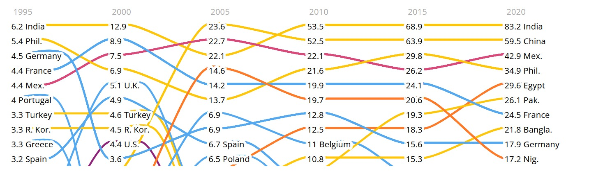
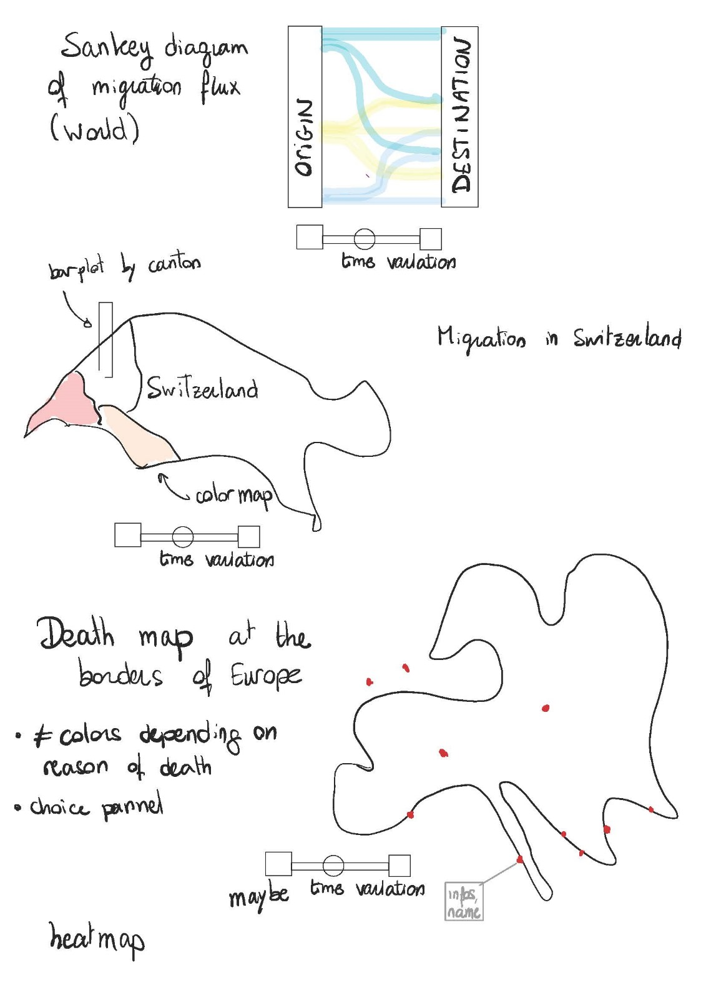

# Milestone 1
| Name | SCIPER | Github |
| ---- | ------ | ------ |
| Lola Maïa Lou Bardel | 299886 | [Lola-Bardel](https://github.com/Lola-Bardel) |
| Stefanie Helfenstein | 327500 | [shelfens](https://github.com/shelfens) |
| Casimir Maximilian Nüsperling | 330680 | [cmaximilian](https://github.com/cmaximilian) |
| Nicolas Filimonov | 313213 | [Rayjine](https://github.com/Rayjine) |

## Dataset
We decided to work on migration as a general topic. After some research, there are three data sets that sprung to our eyes, which we want to explore for visualization:

### UNDESA
**_Publisher:_** United Nations Department of Economic and Social Affairs (UNDESA)  
**_Type of publisher:_** International Organization  
**_Dataset:_** International Migrant Stock 2020  
**_Description:_** Data on human migrations between countries/regions/continent is compiled by slices of five years, from 1990 to 2020.   
**_Our focus:_** We focus our attention for the files containing data by age, sex, destination, as well as sex, destination and origin  

### UNITED
**_Publisher:_** United Against Refugee Deaths  
**_Type of publisher:_** Non-governmental organization  
**_Dataset:_** List of Refugee Deaths with Geographic Coordinates  
**_Description:_** This NGO collects information about migrants deaths and notes the geographic position where their dead corpse has been recorded. They provide data from 1993 to 2023.  
**_Our focus:_** Visualize the human behind the data and the scope of the deaths on migration routes towards Europe. 

### SEM
**_Publisher:_** State Secretariat for Migration of the Swiss Confederation  
**_Type of publisher:_** Governmental organization   
**_Dataset:_** Asylum statistics from 1994 to 2023   
**_Description:_** The state secretariat for migration of the Swiss confederation published asylum statistics from 1994 to 2023.  
**_Our focus:_** We focus our attention on the files containing the data of people in the asylum process as well as in the return support process. We have monthly data for both datasets in the time span  2013-2023, whereby we will focus on this period.   

## Problematic
*Motivation & Visualization:* 
The public scene is often polarized and emotionally charged around the subject of migration. Sometimes it can be difficult to obtain "unbiased" (we are aware that this does not exist strictly speaking) data-driven information on the subject. We are interested in unveiling the order of magnitude of global migration, without overlooking the fact that each incident involves a real person. Better knowledge of migrations flows, statistics, etc. can add value to the discussions on migration in our society and our perception of the subject. As the saying tells us: "A picture is worth more than a thousand words." That may be even truer when the visualization is interactive!

*Target audience:*  
Our target audience ranges from curious internet travelers to future data-viz students stumbling upon our website in search of inspiration. We hope the visualizations give other people (and ourselves!) new input and perspectives to reflect upon, raise awareness and maybe even act as a conversation starter. In the future, those visualizations could potentially be useful for NGOs or citizens interested in human migration and data visualization.

## Exploratory Data Analysis
The analysis of our datasets and first visualisations were conducted in the folder "notebooks" in Jupiter notebooks (data_exploration..) in the Github.

To get a further understanding of our data, we conducted some first visualisations. For the spatiality, we imported shapefiles of the world and merged it with our existing datasets. 

Another exploratory data analysis that was made were heatmaps with the origin and destination classifications in them.

  
  

## Related work
Migration flows of humans, refugees or not, are now well documented and numerous data are available. Official institutions as well as press actors or NGOs investigate the subject and produce numerous visualizations. We did not find any work made in the scope of this class related to our project, but it is elsewhere broadly approached, as you will see below.

We are confident that our approach is original because our aim is to represent data at various levels: global, national (specifically within Switzerland), and individual. This multifaceted representation is designed to allow our public to understand the order of magnitude, get a sense of the situation and if we manage (timewise) to work on the UNITED dataset, engage with the data of individual persons. One of the core aspects of our project is to rehumanize depersonalized statistics, to make the real and human aspect of migration felt by the user. Each migrant, in the multitude of millions, is a unique individual with their own story, a story that we aim to convey.

Our project draws inspiration from a variety of sources, each contributing unique perspectives and methodologies that inform our approach to visualizing migration data. Below, we detail these sources and their relevance to our work.

<ul>
<li>Border Forensics – Investigates the violence at borders and advocates for mobility justice. Their critical analysis of   border control policies and practices provides a lens through which we can explore the complexities of migration and the   challenges faced by migrants. This perspective encourages us to consider the human impact of migration beyond mere     
  numbers.
  https://www.borderforensics.org/</li>

<li>The Flight of Refugees Around the Globe by The New York Times – This article offers a comprehensive visualization of   
  refugee movements worldwide, providing insights into the scale, patterns, and routes of human migration. It serves as a    poignant reminder of the global nature of migration issues and the human stories behind the statistics.
  https://www.nytimes.com/interactive/2015/06/21/world/map-flow-desperate-migration-refugee-crisis.html</li>

  

    
    <em> Example of a visual graphic in the topic of migration. New York Times: The Flight of Refugees Around the Globe </em>
  

  
<li>Investigations by Forensic Architecture – A research agency that employs architectural techniques and technologies to investigate cases of state violence and human rights violations. Their work showcases innovative methods of data visualization and analysis, offering inspiration for how complex information can be communicated effectively.</li>

<li>The Interactive World Migration Report, available at https://worldmigrationreport.iom.int/wmr-2022-interactive,  provides an extensive overview of global migration trends and data. This interactive platform demonstrates the potential of digital tools to engage audiences with complex datasets, inspiring our project's focus on interactive visualization techniques.</li>

    
    <em>Example of a Shankey diagram. Here for money flow. Source: World Bank </em>

## Visualizations
 

Below are the different illustrations (in quick sketches) that we imagined for each dataset mentioned above. The idea was to work with the spatiality of the data, but also explore the relations between the different countries and render this data interactive in an interesting way.  

A Sankey diagram of migration flow between the principal geographical regions would use the UNDESA data set, across the years. At a country scale, we could use the confederation data to produce a color map or plot map of various quantities related to asylum seekers and migrants in Switzerland by canton.  Finally, based on the UNITED dataset, we imagine producing the Europe map with red dots marking places of reported migrants deaths, with information rising up when skimmed over. The order and realization could change, depending on our vision and the direction the project takes.

    
    <em>Sketches of possible visualizations</em>

