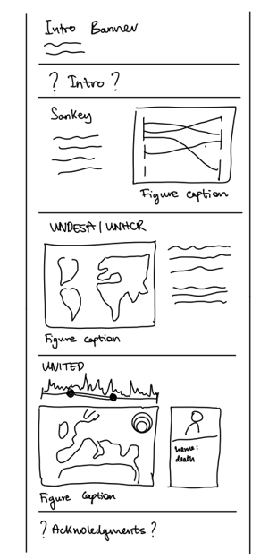
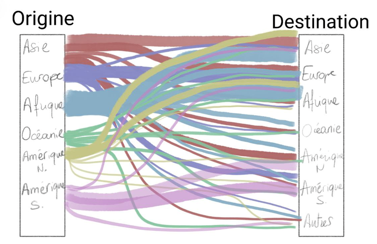
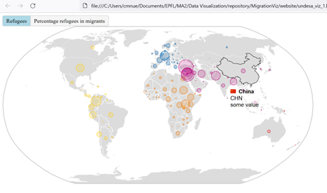
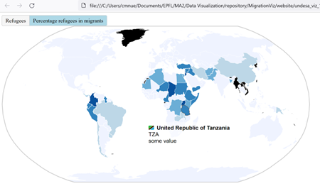
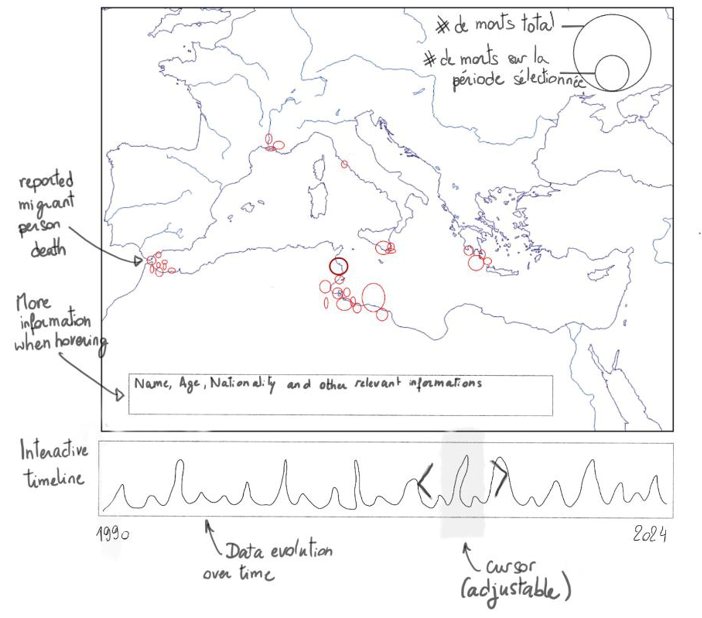

# Milestone 2

| Name | SCIPER | Github |
| ---- | ------ | ------ |
| Lola Maïa Lou Bardel | 299886 | [Lola-Bardel](https://github.com/Lola-Bardel) |
| Stefanie Helfenstein | 327500 | [shelfens](https://github.com/shelfens) |
| Casimir Maximilian Nüsperling | 330680 | [cmaximilian](https://github.com/cmaximilian) |
| Nicolas Filimonov | 313213 | [Rayjine](https://github.com/Rayjine) |

### Aim
With MigrationViz, we aim to build a site which invites people to explore human migration data. Available for curious internet travelers, friends or ourselves, we hope the website could help unveil the order of magnitude of global migration and refugees' reality, without losing sight that behind every number stands a person. 

### General implementation
<ul>
<li>D3.js (Lecture 4 and 5)  coupled with a very useful resource found on the web "D3.js tips and tricks" from Malcolm Maclean</li>
<li> Application of recommendations found in lectures "Do and don't in data viz" (lecture 7) and storytelling (lecture 12)</li>
</ul>

Overall, the website design is to be done. We are yet to find a color scheme, a font that reflects well the subject we are addressing, but we already put in place a slide-like organization of the structure, as depicted below.

Specific plugin made available through the flexibility of D3.js allows us to produce Sankey diagram as well as maps

## Sankey diagram : flow by continent from origin to destination

**_Explanation:_** As an introduction to our website, we start by representing the flow of migration between continents via a Sankey diagram. The idea behind it is to provide basic numbers: for example, more than half of the migration in Asia, Europe and Africa stays in its continent of origin. When hovering on the links as well as the continents, numbers are displayed to allow digging for more information. 

The visualization will be improved by adding a timeline allowing users to choose to display data from 1990 to 2020 by 5-years slices, to explore evolution over time. Depending on easiness of implementation, clarity as well as design choices, we may put color only on the continent names and not on the links, unlike what is depicted here. 

The work in the following weeks will consist of realizing the tasks below:
<ul>
  <li> data organization in JSON objects of data from 1990, 1995, ... to 2020 </li>
  <li> implementation of an interactive cursor to choose the data period used </li>
  <li> addition of origin and destination above the column that are at the moment unnamed </li>
</ul>

**_Extra ideas:_** If time allows, we could let the public choose if the data is to be displayed by continent (as it is actually done) or more fine-tuned by sub-continent (western Asia, Sub-Saharian Africa…), but questions around readability are raised. Visualization of evolution over time could also be interesting to characterize, but we do not already have a clear idea in mind on this subject.

## Interactive map of migration and refugee data 
**_Explanation:_** 

The screenshot above shows the total number of refugees per country in 2020. It is just the first functional proof of concept  implementation, so still a bit buggy. 

The screenshot above can be accessed by pressing the “Percentage refugees in migrants” button. It shows what percentage of migrants are refugees in every country in 2020.

To achieve a complete visualization, the following steps are required:
<ul>
  <li> Add legends to the map</li>
  <li> Improve the tooltip to remove majority of bugs and add additional relevant information</li>
</ul>

**_Extra ideas:_** 
<ul>
  <li> Explore other data as well using the same visualization implementation</li>
  <li> switch map implementation from GeoJSON to TopoJSON for better charging time and more accurate maps  </li>
  <li> Display data in time</li>
</ul>

## Map of refugee deaths at European Borders

**_Explanation:_** Focusing on the Mediterranean region, we visualize the deaths of the people trying to reach Europe. We display the information of their death as points of varying diameters, related with the reported number of people that died for each tragedy. When hovering, complementary information that the database may furnish are displayed. This visualization aims to highlight the individuality of the tragedies that stroke. We try to emphasize the fact that on our map, points stand for people and not only for data. 

Furthermore, in order to be able to explore the data further, you can choose the time period you want to have displayed on an interactive timeline. The cursor is adjustable. On the y axis the total number of deaths per month is displayed as a line over time. 

Another element of the map is the number of people displayed in comparison with the number of people in total represented through the dataset. This is illustrated in the form of text and corresponding circle sizes on the top right of the map. 

**_Extra ideas:_** In order to be able to better understand the map, we will need to add a legend explaining the size of the circles and their significance. Another idea was to display the complementary information about the events in an explanation box on the right of the map. As we advance, the style of the map will be defined along the website design.

